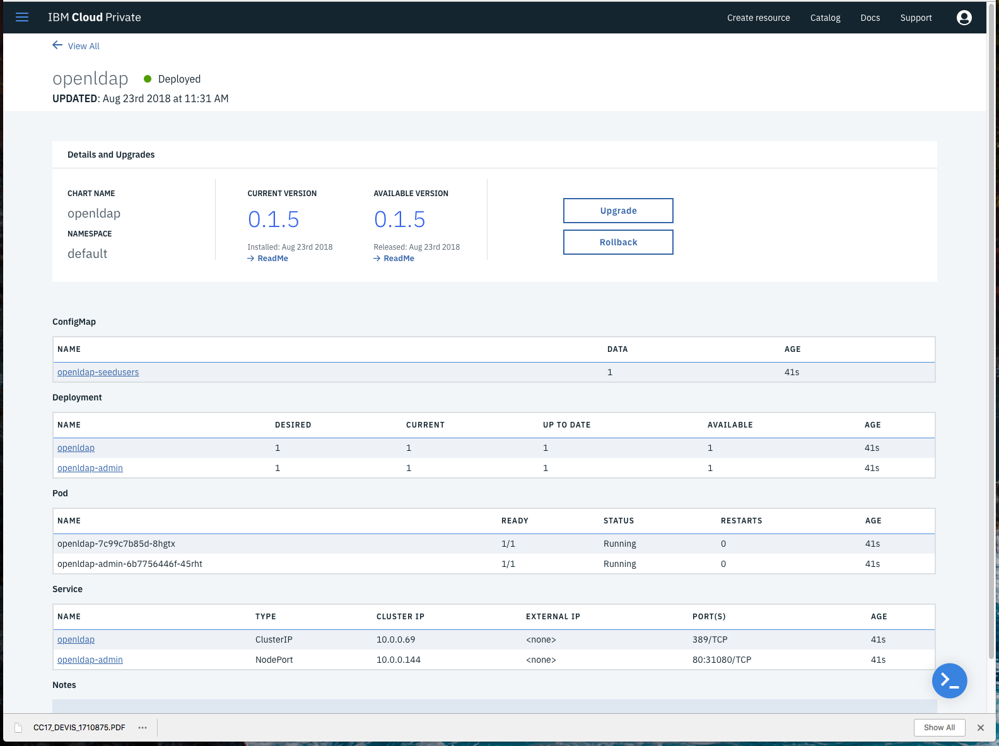
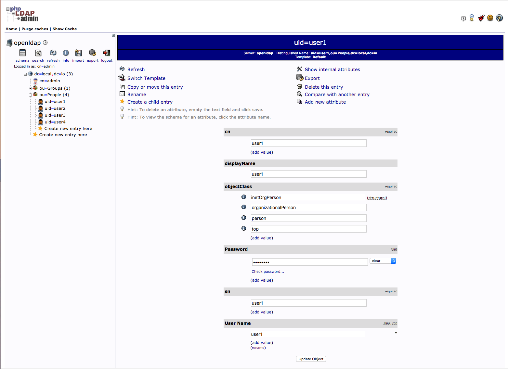
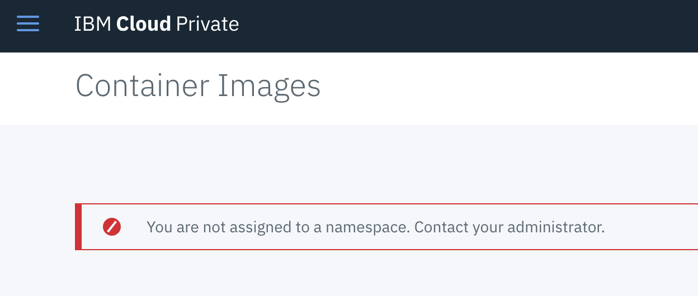

---


# LDAP Lab

The purpose of this lab is to quickly demonstrate how to install and connect Open LDAP to IBM Cloud Private to control access of all the different kinds of administrator. 

We cover 5 steps :
- Check helm
- Installing Open LDAP thru a helm chart in ICP
- Configure and connect the created LDAP to ICP Authentication components
- Create a team with specific user IDs and roles
- Connect with one of the user IDs and test your authorizations


> **Prerequisites** : you should be logged on your VM and connected to your ICP master.


### Table of Contents

---
- [Task 1: Check helm](#task-1--check-helm)
- [Task 2: Install Open LDAP](#task-2--install-open-ldap)
- [Task3: Connect Open LDAP to ICP](#task3--connect-open-ldap-to-icp)
- [Task4: Create a Team](#task4--create-a-team)
- [Task5: Check Roles](#task5--check-roles)
- [Congratulations](#congratulations)
---


# Task 1: Check helm

We are about to install Open LDAP thru a helm package. 
Before starting this step, we should have a valid helm configuration. 
Here are some steps you need to flow to check helm : 

`helm version --tls`

Results should be :

```console
# helm version --tls
Client: &version.Version{SemVer:"v2.9.1", GitCommit:"20adb27c7c5868466912eebdf6664e7390ebe710", GitTreeState:"clean"}
Server: &version.Version{SemVer:"v2.9.1+icp", GitCommit:"843201eceab24e7102ebb87cb00d82bc973d84a7", GitTreeState:"clean"}
```

**If you get this valid answer, then go to the installation lab.**


# Task 2: Install Open LDAP

Get the source code of the helm chart for Open LDAP taht we are going to install our cluster. 

```
git clone https://github.com/ibm-cloud-architecture/icp-openldap.git openldap
```
> Note : don't change the name of the directory (**openldap**) created 

A new directory **openldap** is created.

Package the helm chart using the helm cli:

`helm package openldap`

Results:
```console 
# helm package openldap
Successfully packaged chart and saved it to: /root/openldap-0.1.5.tgz
```

If you have not, log in to your cluster from the IBM Cloud Private CLI and log in to the Docker private image registry. 

`docker login mycluster.icp:8500 -u admin -p admin`

Results:

```console
# docker login mycluster.icp:8500 -u admin -p admin
WARNING! Using --password via the CLI is insecure. Use --password-stdin.
Login Succeeded
```

Then login with the cloudctl command:

`cloudctl login -a https://mycluster.icp:8443 --skip-ssl-validation`

> Use the admin/admin credentials and choose **1** and **default**.

Populate the Helm chart in the IBM Cloud Private catalog :

```
cloudctl catalog load-chart --archive /root/openldap-0.1.5.tgz 
```

Results:
```console 
# cloudctl catalog load-chart --archive /root/openldap-0.1.5.tgz
Loading helm chart
Loaded helm chart

Synch charts
Synch started
OK
```

Before we can use this archive to create a LDAP instance, we need to be sure that we will not have any security issue. In IBM Cloud Private solution, IBM has implemented the **Cluster Image Policy**.

For each image in a repository, an image policy scope of either `cluster` or `namespace` is applied. When you deploy an application, IBM Container Image Security Enforcement checks whether the Kubernetes namespace that you are deploying to has any policy regulations that must be applied. If a `namespace`policy does not exist, then the `cluster` policy is applied. If neither a `cluster` or `namespace` scope policy exist, your deployment fails to launch.

By default this feature is **active** and we need to authorize the images that we want to load in a pod.

A new cluster image policy can be created with the necessary image repositories by using the following command (copy and paste all the lines):

```
kubectl create -f - <<EOF
apiVersion: securityenforcement.admission.cloud.ibm.com/v1beta1
kind: ClusterImagePolicy
metadata:
  name: ldap-cluster-image-policy
spec:
  repositories:
  - name: docker.io/osixia*
EOF
```

Result:

```
clusterimagepolicy.securityenforcement.admission.cloud.ibm.com/ldap-cluster-image-policy created
```

Login to ICP console.

Go to the Catalog.

Type **open** in the search zone to retrieve **openldap** package.


Click on **openldap** and **Configure** to see the parameters.
Add a release name **openldap** and the **default** namespace. 


Click **Install**. Then Click **View Helm Releases**.



> Note : The Available Column should be **1**.

Take a note of the **ClusterIP** for a future use:


To get access to the Open LDAP portal, use the following URL (where the i-address is the VM ip address):

http://ipaddress:31080


Click on Login and type the following credentials :
user:
`cn=admin,dc=local,dc=io` 
password:
`admin`

You should see the following page:


> Note : 4 users have been pre-populated.

See below the **user1**:



# Task3: Connect Open LDAP to ICP

Now we need to connect our newly created Open LDAP to ICP Authentication Component.
To do so, from the ICP console, Navigate to **Manage > Identity and Access > Authentication**: 


Click on the **Set up the connection** link.

Then enter some details:

**LDAP Connection**
- Name: ldap
- Type: Custom


**LDAP authentication**

- Base DN: `dc=local,dc=io` (default value, adjust as needed)
- Bind DN: `cn=admin,dc=local,dc=io` (default value, adjust as needed)
- Admin Password: `admin` (default value, adjust as needed)


**LDAP URL**

- URL: `ldap://clusterip:389` (use the IP address we collected in task2)


Click on **Test Connection** button to check the connection. You should get a green tick.


Then modify the filters:

**LDAP Filters**

- Group filter: `(&(cn=%v)(objectclass=groupOfUniqueNames))`
- User filter: `(&(uid=%v)(objectclass=person))`
- Group ID map: `*:cn`
- User ID map: `*:uid`
- Group member ID map: `groupOfUniqueNames:uniquemember`


Then Click on **Connect**. If no error, then the following list should appear:


Our new Open LDAP is now connected to the ICP Cluster.

# Task4: Create a Team

From the ICP console, Navigate to **Menu > Manage >  Identity and Access > Teams** and click on the link **Create a Team**:


Enter a team name : **myteam**
Click on the **users** button. Enter **user** in the search field. Check all 4 users to be part of the team. Then choose some **roles** as shown below.


Click **Create**


Now our team is ready to support login in ICP. 

# Task5: Check Roles

**Log out** from the ICP Console.

**Log in ** again to the ICP Console with the Cluster Admin role :
User ID : `user1`
Password : `ChangeMe`

Check some menu (we should have complete access to all menus)

**Log out** from the ICP Console.

**Log in ** again to the ICP Console with the viewer role :
User ID : `user4`
Password : `ChangeMe`

Check the Image Container menu and you should receive:



If you are interested in the different roles, look at the following link:

https://www.ibm.com/support/knowledgecenter/en/SSBS6K_3.1.0/user_management/assign_role.html

# Congratulations 

You have successfully installed, deployed an OPEN LDAP using helm and then you ahve customized the LDAP connection to ICP. Finally you successfully customized different roles for different users in one team in an **IBM Cloud Private** cluster.

----


