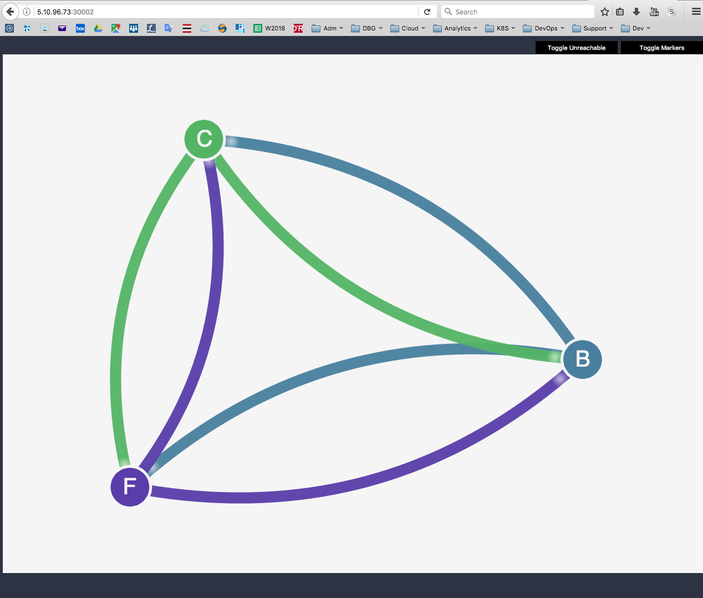
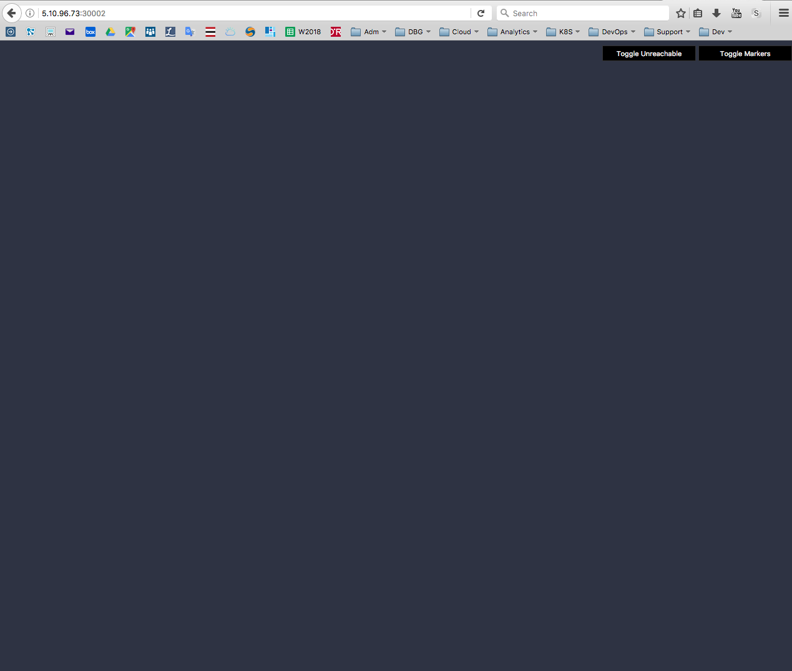
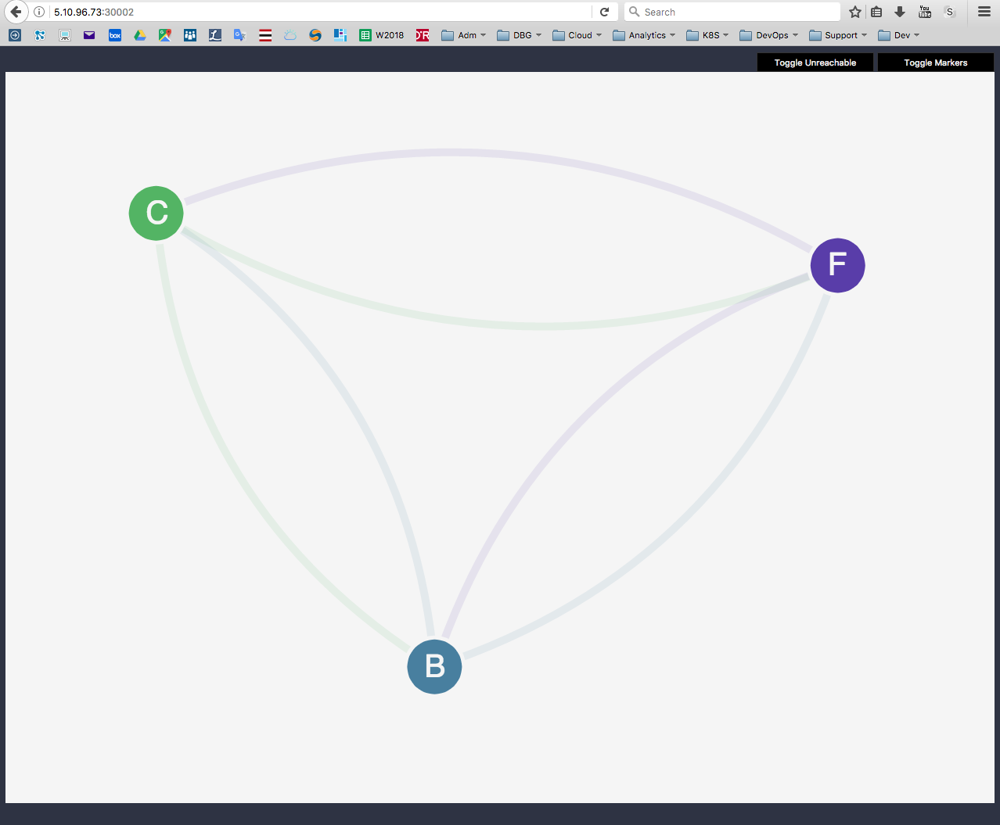
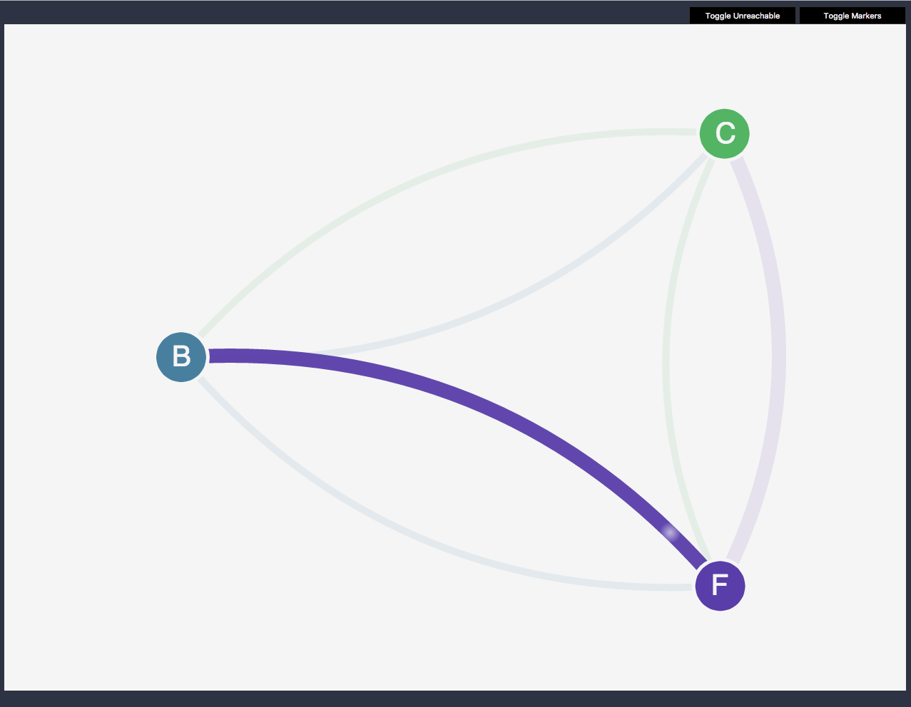
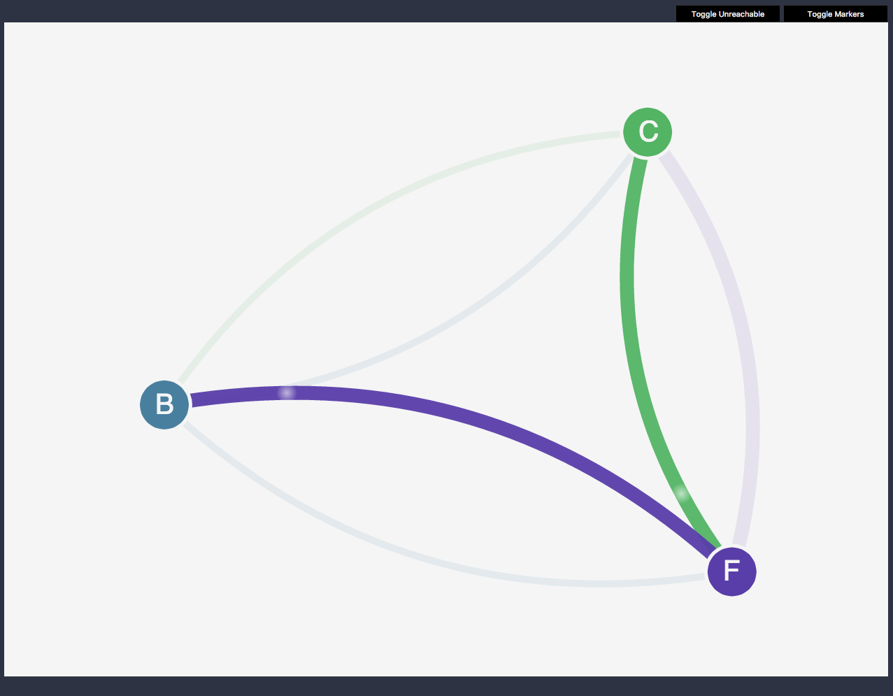

---


# Netwok Policy Lab

**Calico** provides secure network connectivity for containers and virtual machine workloads.

Calico creates and manages a flat layer 3 network, assigning each workload a fully routable IP address. Workloads can communicate without IP encapsulation or network address translation for bare metal performance, easier troubleshooting, and better interoperability. In environments that require an overlay, Calico uses IP-in-IP tunneling or can work with other overlay networking such as flannel.

Calico also provides dynamic enforcement of network security rules. Using Calico’s simple policy language, you can achieve fine-grained control over communications between containers, virtual machine workloads, and bare metal host endpoints.

Proven in production at scale, Calico v3.2 features integrations with Kubernetes and OpenStack. 

Calico is made up of the following interdependent components:

- **Felix**, the primary Calico agent that runs on each machine that hosts endpoints.
- The **Orchestrator plugin**, orchestrator-specific code that tightly integrates Calico into that orchestrator.
- **etcd**, the data store.
- **BIRD**, a BGP client that distributes routing information.

BGP Route Reflector (BIRD), an optional BGP route reflector for higher scale.

For more information, see : **https://docs.projectcalico.org/v3.2/reference/architecture/**

One of Calico’s key features is how packets flow between workloads in a data center, or between a workload and the Internet, **without additional encapsulation**.

In the Calico approach, IP packets to or from a workload are routed and firewalled by the **Linux routing table** and **iptables** infrastructure on the workload’s host. For a workload that is sending packets, Calico ensures that the host is always returned as the next hop MAC address regardless of whatever routing the workload itself might configure. For packets addressed to a workload, the last IP hop is that from the destination workload’s host to the workload itself.


Suppose that IPv4 addresses for the workloads are allocated from a datacenter-private subnet of 10.65/16, and that the hosts have IP addresses from 172.18.203/24. If you look at the routing table on a host you will see something like this:


There is one workload on this host with IP address 10.65.0.24, and accessible from the host via a TAP (or veth, etc.) interface named tapa429fb36-04. Hence there is a direct route for 10.65.0.24, through tapa429fb36-04. Other workloads, with the .21, .22 and .23 addresses, are hosted on two other hosts (172.18.203.126 and .129), so the routes for those workload addresses are via those hosts.

The direct routes are set up by a Calico agent named Felix when it is asked to provision connectivity for a particular workload. A BGP client (such as BIRD) then notices those and distributes them – perhaps via a route reflector – to BGP clients running on other hosts, and hence the indirect routes appear also.

The routing above in principle allows any workload in a data center to communicate with any other – but in general, an operator will want to restrict that; for example, so as to isolate customer A’s workloads from those of customer B. Therefore Calico also programs iptables on each host, to specify the IP addresses (and optionally ports etc.) that each workload is allowed to send to or receive from. This programming is ‘bookended’ in that the traffic between workloads X and Y will be firewalled by both X’s host and Y’s host – this helps to keep unwanted traffic off the data center’s core network, and as a secondary defense in case it is possible for a rogue workload to compromise its local host.

Is that all ? As far as the static data path is concerned, yes. It’s just a combination of responding to workload ARP requests with the host MAC, IP routing and iptables. There’s a great deal more to Calico in terms of how the required routing and security information is managed, and for handling dynamic things such as workload migration – but the basic data path really is that simple.

> **Prerequisites** : you should be logged on your VM and connected to your ICP master before starting this lab.


### Table of Contents


- [Task 1: Isolation Policy Demo](#task-1--isolation-policy-demo)
    + [Enable Isolation](#enable-isolation)
    + [Allow Access using a NetworkPolicy](#allow-access-using-a-networkpolicy)
- [Task 2: Multiple Application Policy Demo](#task-2--multiple-application-policy-demo)
    + [Create the frontend, backend, client, and management-ui apps](#create-the-frontend--backend--client--and-management-ui-apps)
    + [Enable isolation](#enable-isolation)
    + [Allow the UI to access the Services using NetworkPolicy objects](#allow-the-ui-to-access-the-services-using-networkpolicy-objects)
    + [Allow traffic from the frontend to the backend](#allow-traffic-from-the-frontend-to-the-backend)
    + [Expose the frontend service to the client namespace](#expose-the-frontend-service-to-the-client-namespace)
- [Congratulations](#congratulations)
---


# Task 1: Isolation Policy Demo

To interact with Calico agents and components in a Kubernetes cluster, we use don't manipulate directly Calico but we use a Kubernetes NetwokPolicy to define the different network security rules. 
This lab provides a simple way to try out Kubernetes **NetworkPolicy** with Calico. It requires a Kubernetes cluster configured with Calico networking, and expects that you have kubectl configured to interact with the cluster.

And then define a new namespace in the cluster:

`kubectl create ns policy-demo`

Results:
```console 
# kubectl create ns policy-demo
namespace "policy-demo" created
```

We’ll use Kubernetes Deployment objects to easily create pods in the Namespace.
Create some nginx pods in the policy-demo Namespace, and expose them through a Service.

`kubectl run --namespace=policy-demo nginx --replicas=2 --image=nginx`

`kubectl expose --namespace=policy-demo deployment nginx --port=80`

Results:

```console
# kubectl run --namespace=policy-demo nginx --replicas=2 --image=nginx
deployment.apps "nginx" created
# 
# kubectl expose --namespace=policy-demo deployment nginx --port=80
service "nginx" exposed
```

Ensure the nginx service is accessible.

`kubectl run --namespace=policy-demo access --rm -ti --image busybox /bin/sh`

If you don't see a command prompt, try pressing enter.
Results:
```console 
# kubectl run --namespace=policy-demo access --rm -ti --image busybox /bin/sh

If you don't see a command prompt, try pressing enter.

/ #
```

Then type near the # prompt :
`wget -q nginx -O -`

Results:
```console
/ # wget -q nginx -O -
<!DOCTYPE html>
<html>
<head>
<title>Welcome to nginx!</title>
<style>
    body {
        width: 35em;
        margin: 0 auto;
        font-family: Tahoma, Verdana, Arial, sans-serif;
    }
</style>
</head>
<body>
<h1>Welcome to nginx!</h1>
<p>If you see this page, the nginx web server is successfully installed and
working. Further configuration is required.</p>

<p>For online documentation and support please refer to
<a href="http://nginx.org/">nginx.org</a>.<br/>
Commercial support is available at
<a href="http://nginx.com/">nginx.com</a>.</p>

<p><em>Thank you for using nginx.</em></p>
</body>
</html>
/ # 
```
This html code corresponds to the NGINX welcome page.
Type Ctrl+D to exit the session.

### Enable Isolation

Let’s turn on isolation in our policy-demo Namespace. Calico will then prevent connections to pods in this Namespace.

Running the following command creates a NetworkPolicy which implements a default deny behavior for all pods in the policy-demo Namespace.

Please copy and paste all the lines below in the terminal:

```
kubectl create -f - <<EOF
kind: NetworkPolicy
apiVersion: networking.k8s.io/v1
metadata:
  name: default-deny
  namespace: policy-demo
spec:
  podSelector:
    matchLabels: {}
EOF
```

Results:
```console
networkpolicy.networking.k8s.io "default-deny" created
```

Now test isolation. This will prevent all access to the nginx Service. We can see the effect by trying to access the Service again.

`kubectl run --namespace=policy-demo access --rm -ti --image busybox /bin/sh` 

Results:
```console
kubectl run --namespace=policy-demo access --rm -ti --image busybox /bin/sh
If you don't see a command prompt, try pressing enter.
/ # 

```

Execute the wget command to access nginx:

`wget -q --timeout=5 nginx -O -`

Results:
```console
/ # wget -q --timeout=5 nginx -O -
wget: download timed out
/ # 
```

As you can see, the command timeouts.
The request should time out after 5 seconds. By enabling isolation on the Namespace, we’ve prevented access to the Service.

### Allow Access using a NetworkPolicy

Now, let’s enable access to the nginx Service using a NetworkPolicy. This will allow incoming connections from our access Pod, but not from anywhere else.

Create a network policy **access-nginx** with the following contents:

```
kubectl create -f - <<EOF
kind: NetworkPolicy
apiVersion: networking.k8s.io/v1
metadata:
  name: access-nginx
  namespace: policy-demo
spec:
  podSelector:
    matchLabels:
      run: nginx
  ingress:
    - from:
      - podSelector:
          matchLabels:
            run: access
EOF
```
Results:

```console
networkpolicy.networking.k8s.io "access-nginx" created
```

> Note: The NetworkPolicy allows traffic from Pods with the label run: access to Pods with the label run: nginx. These are the labels automatically added to Pods started via kubectl run based on the name of the Deployment.

We should now be able to access the Service from the access Pod.

`kubectl run --namespace=policy-demo access --rm -ti --image busybox /bin/sh`

Results:
```console
# kubectl run --namespace=policy-demo access --rm -ti --image busybox /bin/sh
If you don't see a command prompt, try pressing enter.
/ # 
```

Type the following command to get access to NGINX from the busybox:
`wget -q --timeout=5 nginx -O -`

Results:
```console
wget -q --timeout=5 nginx -O -
<!DOCTYPE html>
<html>
<head>
<title>Welcome to nginx!</title>
<style>
    body {
        width: 35em;
        margin: 0 auto;
        font-family: Tahoma, Verdana, Arial, sans-serif;
    }
</style>
</head>
<body>
<h1>Welcome to nginx!</h1>
<p>If you see this page, the nginx web server is successfully installed and
working. Further configuration is required.</p>

<p>For online documentation and support please refer to
<a href="http://nginx.org/">nginx.org</a>.<br/>
Commercial support is available at
<a href="http://nginx.com/">nginx.com</a>.</p>

<p><em>Thank you for using nginx.</em></p>
</body>
</html>
/ # 

```

However, we still cannot access the Service from a Pod without the label `run: access`:

`kubectl run --namespace=policy-demo cant-access --rm -ti --image busybox /bin/sh` 

Results:

```console
# kubectl run --namespace=policy-demo cant-access --rm -ti --image busybox /bin/sh
If you don't see a command prompt, try pressing enter.
/ # wget -q --timeout=5 nginx -O -
wget: download timed out
/ # 
```
You can clean up the demo by deleting the demo Namespace:

`kubectl delete ns policy-demo` 

This was just a simple example of the Kubernetes NetworkPolicy API and how Calico can secure your Kubernetes cluster. For more information on network policy in Kubernetes, see the Kubernetes user-guide.

# Task 2: Multiple Application Policy Demo

In this lab, we are going to use multiple application that can or cannot talk to each other.


### Create the frontend, backend, client, and management-ui apps

Use the following commands to create and run multiple applications and services:

```console
kubectl create -f https://docs.projectcalico.org/v3.2/getting-started/kubernetes/tutorials/stars-policy/manifests/00-namespace.yaml
kubectl create -f https://docs.projectcalico.org/v3.2/getting-started/kubernetes/tutorials/stars-policy/manifests/01-management-ui.yaml
kubectl create -f https://docs.projectcalico.org/v3.2/getting-started/kubernetes/tutorials/stars-policy/manifests/02-backend.yaml
kubectl create -f https://docs.projectcalico.org/v3.2/getting-started/kubernetes/tutorials/stars-policy/manifests/03-frontend.yaml
kubectl create -f https://docs.projectcalico.org/v3.2/getting-started/kubernetes/tutorials/stars-policy/manifests/04-client.yaml

```

Wait for all the pods to enter Running state.

`kubectl get pods --all-namespaces --watch`

Results:
```console
# kubectl get pods --all-namespaces --watch
NAMESPACE       NAME                                                          READY     STATUS      RESTARTS   AGE
client          client-9w79b                                                  1/1       Running     0          4m
kube-system     auth-apikeys-kvmw7                                            1/1       Running     0          4h
...
management-ui   management-ui-8mt72                                           1/1       Running     0          4m
stars           backend-q8647                                                 1/1       Running     0          4m
stars           frontend-f4mzt                                                1/1       Running     0          4m
```

Note that it may take several minutes to download the necessary Docker images for this demo.

The management UI runs as a NodePort Service on Kubernetes, and shows the connectivity of the Services in this example.

You can view the UI by visiting http://ipaddress:30002 in a browser.




Once all the pods are started, they should have full connectivity. You can see this by visiting the UI. Each service is represented by a single node in the graph.

    backend -> Node “B”
    frontend -> Node “F”
    client -> Node “C”

### Enable isolation

Running following commands will prevent all access to the frontend, backend, and client Services.

```
kubectl create -n stars -f https://docs.projectcalico.org/v3.2/getting-started/kubernetes/tutorials/stars-policy/policies/default-deny.yaml
kubectl create -n client -f https://docs.projectcalico.org/v3.2/getting-started/kubernetes/tutorials/stars-policy/policies/default-deny.yaml
```

Refresh the management UI (it may take up to 10 seconds for changes to be reflected in the UI). Now that we’ve enabled isolation, the UI can no longer access the pods, and so they will no longer show up in the UI.



### Allow the UI to access the Services using NetworkPolicy objects

``` 
kubectl create -f https://docs.projectcalico.org/v3.2/getting-started/kubernetes/tutorials/stars-policy/policies/allow-ui.yaml
kubectl create -f https://docs.projectcalico.org/v3.2/getting-started/kubernetes/tutorials/stars-policy/policies/allow-ui-client.yaml
```


###  Allow traffic from the frontend to the backend

Type the following command:

```
kubectl create -f https://docs.projectcalico.org/v3.2/getting-started/kubernetes/tutorials/stars-policy/policies/backend-policy.yaml
```

Refresh the UI. You should see the following:

    The frontend can now access the backend (on TCP port 80 only).
    The backend cannot access the frontend at all.
    The client cannot access the frontend, nor can it access the backend.



### Expose the frontend service to the client namespace

Type the following command:

```
kubectl create -f https://docs.projectcalico.org/v3.2/getting-started/kubernetes/tutorials/stars-policy/policies/frontend-policy.yaml
```




The client can now access the frontend, but not the backend. Neither the frontend nor the backend can initiate connections to the client. The frontend can still access the backend.

To clean-up the applications:
```
kubectl delete ns client stars management-ui
​````


# Congratulations 

You have successfully implemented Kubernetes NetworkPolicies using Calico  an **IBM Cloud Private** cluster.

----


```


